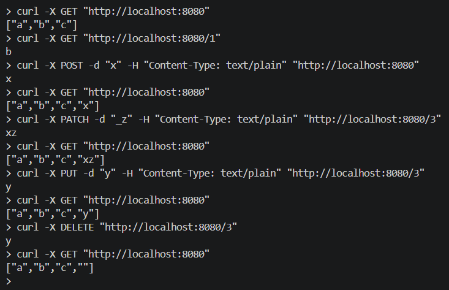
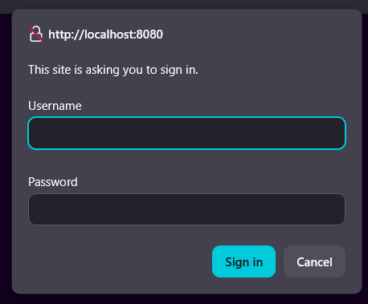
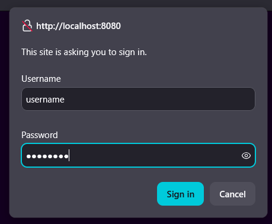
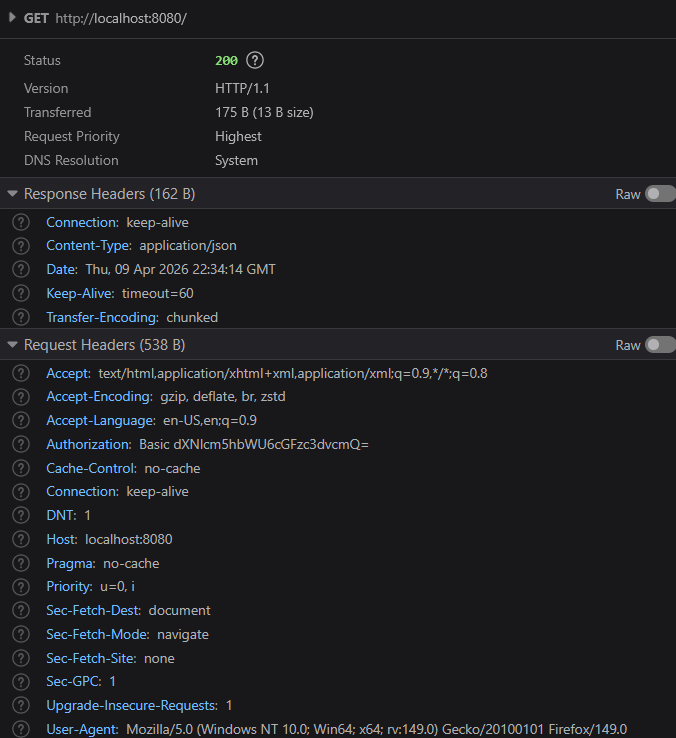

# Projektowanie Obiektowe

## [Zadanie 1 - Paradygmaty](./1/)

Sortowanie bąbelkowe

Proszę napisać [program w Pascalu](./1/1.pas), który zawiera dwie procedury, jedna generuje listę 50 losowych liczb od 0 do 100. Druga procedura sortuje liczbę za pomocą sortowania bąbelkowego.

- [x] 3.0 Procedura do generowania 50 losowych liczb od 0 do 100
- [x] 3.5 Procedura do sortowania liczb
- [x] 4.0 Dodanie parametrów do procedury losującej określającymi zakres losowania: od, do, ile
- [x] 4.5 5 testów jednostkowych testujące procedury
- [x] 5.0 [Skrypt w bashu](./1/run.sh) do uruchamiania aplikacji w Pascalu via docker

Termin: 25.03

## [Zadanie 2 - Wzorce architektury](./2/)

Symfony (PHP)

Należy stworzyć aplikację webową na bazie frameworka Symfony na obrazie kprzystalski/projobj-php:latest. Baza danych dowolna, sugeruję SQLite.

- [x] 3.0 Należy stworzyć jeden [model](./2/products/src/Entity/Product.php) z [kontrolerem](./2/products/src/Controller/ProductsController.php) z produktami, zgodnie z CRUD (JSON)
- [x] 3.5 Należy stworzyć [skrypty do testów endpointów via curl](./2/tests/) (JSON)
- [ ] 4.0 Należy stworzyć dwa dodatkowe kontrolery wraz z modelami (JSON)
- [ ] 4.5 Należy stworzyć widoki do wszystkich kontrolerów
- [ ] 5.0 Stworzenie panelu administracyjnego

Termin: 2.04

## [Zadanie 3 - Wzorce kreacyjne](./3/)

Spring Boot (Kotlin)

Proszę stworzyć prosty serwis do autoryzacji, który zasymuluje autoryzację użytkownika za pomocą przesłanej nazwy użytkownika oraz hasła. Serwis powinien zostać wstrzyknięty do kontrolera (4.5).
Aplikacja ma oczywiście zawierać jeden kontroler i powinna zostać napisana w języku Kotlin. Oparta powinna zostać na frameworku Spring Boot. Serwis do autoryzacji powinien być singletonem.

- [x] 3.0 Należy [stworzyć jeden kontroler](./3/src/main/kotlin/example/projektowanieobiektowe/po3/Po3Application.kt) wraz z danymi wyświetlanymi z listy na endpoint’cie w formacie JSON - Kotlin + Spring Boot
- [x] 3.5 Należy stworzyć klasę do autoryzacji (mock) jako Singleton w formie eager
- [x] 4.0 Należy obsłużyć dane autoryzacji przekazywane przez użytkownika
- [ ] 4.5 Należy wstrzyknąć singleton do głównej klasy via @Autowired lub kontruktor (constructor injection)
- [ ] 5.0 Obok wersji Eager do wyboru powinna być wersja Singletona w wersji lazy

|   |   |   |
| - | - | - |
|  |  |  |

## [Zadanie 4 - Wzorce strukturalne](./4/)

Echo (Go)

Należy stworzyć aplikację w Go na frameworku echo. Aplikacja ma mieć jeden endpoint, minimum jedną funkcję proxy, która pobiera dane np. o pogodzie, giełdzie, etc. (do wyboru) z zewnętrznego API. Zapytania do endpointu można wysyłać w jako GET lub POST.

- [x] 3.0 Należy stworzyć [aplikację](./4/main.go) we frameworki echo w j. Go, która będzie miała kontroler [Pogody](./4/routes.go), która pozwala na pobieranie danych o pogodzie (lub akcjach giełdowych)
- [x] 3.5 Należy stworzyć model [Pogoda](./4/data.go) (lub Giełda) wykorzystując gorm, a dane załadować z listy przy uruchomieniu
- [ ] 4.0 Należy stworzyć klasę proxy, która pobierze dane z serwisu zewnętrznego podczas zapytania do naszego kontrolera
- [ ] 4.5 Należy zapisać pobrane dane z zewnątrz do bazy danych
- [x] 5.0 Należy rozszerzyć [endpoint](./4/routes.go) na więcej niż jedną lokalizację (Pogoda), lub akcje (Giełda) zwracając JSONa

Termin: 23.04

## [Zadanie 5 - Wzorce behawioralne](./5/)

React (JavaScript/Typescript) + Serwer (dowolny język)

- [x] 3.0 W ramach projektu należy stworzyć komponenty [Produkty](./5/src/Products.jsx) oraz [Płatności](./5/src/Payments.jsx); komponent Produkty powinien pobierać listę produktów z aplikacji serwerowej, natomiast komponent Płatności powinien wysyłać dane płatności do aplikacji serwerowej.
- [x] 3.5 Należy dodać komponent [Koszyk](./5/src/Cart.jsx) wraz z osobnym widokiem; aplikacja powinna umożliwiać przechodzenie pomiędzy widokami przy użyciu [routingu](./5/src/App.jsx).
- [x] 4.0 Dane pomiędzy komponentami, takimi jak Produkty, Koszyk i Płatności, powinny być przekazywane z wykorzystaniem [React hooks](./5/src/state.ts), np. useState, useEffect lub useContext.
- [x] 4.5 Należy przygotować [konfigurację](./5/docker-compose.yaml) umożliwiającą uruchomienie [aplikacji klienckiej](./5/Dockerfile) oraz [serwerowej](./5/server/Dockerfile) w kontenerach Docker za pomocą docker-compose.
- [x] 5.0 Należy wykorzystać bibliotekę axios do [komunikacji](./5/src/App.tsx) z [serwerem](./5/src/Payments.tsx) oraz [skonfigurować obsługę CORS](./5/server/main.go), aby frontend mógł poprawnie komunikować się z backendem.

Termin: 14.05
